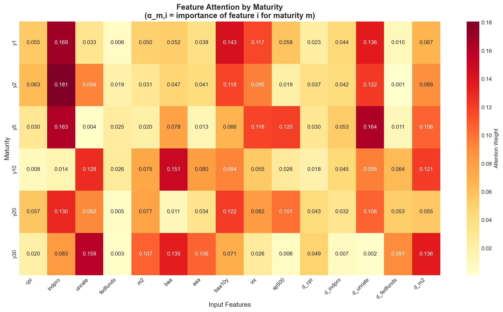

# Corporate Bond Yield Curve Forecasting

> **Here's the thing about linear regression and corporate bonds: it breaks down spectacularly.**  
> I built this system to learn conditional yield expectations using neural networks, detect when things go wrong, and give you interpretable insights into what's driving yields across different maturities—all while running in under a millisecond.

---

## The Problem I'm Trying to Solve

If you work with corporate bonds, you know that yield curves (spanning 1Y to 30Y maturities) are critical for:

- Pricing credit and managing risk
- Estimating term premiums
- Making smart portfolio decisions

But here's where it gets frustrating. Traditional models just don't work well, and here's why:

| Challenge             | What Goes Wrong                                                                                          |
| --------------------- | -------------------------------------------------------------------------------------------------------- |
| **Multicollinearity** | Macro variables like CPI, Fed Funds, and M2 are all tangled up—regression coefficients become unreliable |
| **Non-stationarity**  | Yields and macro factors drift over time, which leads to spurious correlations                           |
| **Regime shifts**     | When COVID hit, or during QE, or the inflation surge—models trained on old data just fall apart          |

So I decided to build something better. A system that's honest about what it can and can't do, but actually works when conditions are stable.

---

## The Data I'm Working With

I'm using monthly U.S. macro-financial data from 2016 to 2025—that's 119 observations total.

| Feature Group | Variables                                               |
| ------------- | ------------------------------------------------------- |
| Macro Levels  | CPI, Industrial Production, Unemployment, Fed Funds, M2 |
| Credit/Risk   | BAA/AAA spreads, BAA-10Y spread, VIX                    |
| Market        | S&P 500                                                 |
| Targets       | 1Y, 2Y, 5Y, 10Y, 20Y, 30Y corporate yields              |

### What I Found in the Diagnostics

- VIF scores above 10 for multiple variables—multicollinearity is definitely a problem
- Unit root tests (ADF) show all yield series are non-stationary, macro variables are mixed
- Clear regime breaks: COVID (March 2020), the QE period (2020-2021), and the inflation surge in 2022

_Check out [Notebook 01](Notebooks/01_data_understanding.ipynb) and [Notebook 02](Notebooks/02_statistical_diagnostics.ipynb) for the full analysis_

---

## Baseline Models (And Why They Fail)

Before jumping to fancy neural networks, I wanted to see how simple approaches perform. The results were... interesting.

### Out-of-Sample MSE (Test Period)

| Maturity | Random Walk | Linear Regression |
| -------- | ----------- | ----------------- |
| 1Y       | 0.043       | **2.289** ❌      |
| 2Y       | 0.064       | **2.851** ❌      |
| 5Y       | 0.063       | **1.360** ❌      |
| 10Y      | 0.046       | 0.052             |
| 20Y      | 0.038       | 0.018             |
| 30Y      | 0.036       | **0.377** ❌      |

**What this tells me**: Linear regression completely blows up on short maturities because of multicollinearity. And honestly? A random walk is surprisingly hard to beat when things are stable.

_See [Notebook 04](Notebooks/04_baseline_models.ipynb) for how I built these baselines_

---

## The Neural PEA Model

### So What's a Parameterized Expectations Algorithm?

PEA is essentially a way to approximate conditional expectations:

```
E[Y_t | S_t] ≈ f_θ(S_t)
```

In plain English:

- `Y_t` = the yield curve at time t (across 6 maturities)
- `S_t` = the current macro-financial state (normalized features)
- `f_θ` = a neural network that learns the relationship

### Why I Designed It This Way

1. **No cheating with lagged yields** — I'm not using past yields as inputs, which would be data leakage
2. **Economic meaning** — The state variables actually mean something financially
3. **Efficient multi-output** — One forward pass gives you the entire yield curve

### The Architecture

It's actually pretty simple:

```
Input (15 features)
    ↓
Linear(64) → ReLU
    ↓
Linear(64) → ReLU
    ↓
Linear(6 maturities)
```

- Around 5,000 parameters total
- Trained with MSE loss and Adam optimizer, with early stopping to prevent overfitting
- Inference runs in under 1 millisecond on CPU

_Training details are in [Notebook 05](Notebooks/05_neural_expectations_model.ipynb)_

---

## Making It Interpretable with Attention

The basic PEA model treats all features equally for all maturities. But that doesn't make economic sense:

- Short-term yields should care more about Fed Funds and current inflation
- Long-term yields should focus on growth expectations and term premium

### Adding Maturity-Specific Attention

I extended the model with learned attention weights per maturity:

```
S_t → Shared Encoder → Per-Maturity Attention → Yield Outputs
```

### What the Attention Weights Show



**What I'm seeing here**:

- 1Y and 2Y yields pay more attention to Fed Funds and CPI
- 10Y and 30Y yields have more balanced, growth-oriented weighting
- VIX attention increases during stress periods

_Attention visualizations are in [Notebook 06](Notebooks/06_attention_analysis.ipynb)_

---

## Regime Detection (Because Models Fail)

Look, I need to be honest: **all models fail when the regime changes**. The question isn't whether they fail, but whether you can detect it.

### Adversarial Validation

I trained a classifier to distinguish between training and test periods:

| Metric         | Value | What It Means             |
| -------------- | ----- | ------------------------- |
| AUC (Logistic) | 1.00  | Severe distribution shift |
| AUC (GBM)      | 1.00  | Confirms regime break     |

**This is actually expected.** The 2020 shock fundamentally changed how markets work.

### Performance Across Different Regimes

| Regime                      | Random Walk MSE | Notes                |
| --------------------------- | --------------- | -------------------- |
| Pre-COVID (2016-2020)       | 0.032           | Stable, low error    |
| COVID Shock (Mar-Jun 2020)  | 0.073           | Error spike          |
| QE-ZeroRate (2020-2021)     | 0.019           | Low volatility       |
| Inflation Surge (2022-2023) | 0.140           | High error           |
| High-Rate (2023+)           | 0.065           | Elevated uncertainty |

### My Model Trust Policy

I don't just deploy this and hope for the best. Here's what I check:

```
IF adversarial_auc > 0.75:
    → FLAG for manual review
    → Predictions should NOT be used for trading
    → Trigger retraining pipeline

IF rolling_mse > 2× training_mse:
    → Blend with random walk (50/50)
    → Increase prediction uncertainty
```

_Full regime analysis is in [Notebook 07](Notebooks/07_regime_shift_validation.ipynb)_

---

## Inference Speed

If you're doing real-time pricing, you need this to be fast. Like, really fast.

### Benchmark Results (CPU, 1000 iterations)

| Model           | Mean Latency | P99 Latency |
| --------------- | ------------ | ----------- |
| Base PEA        | ~0.3 ms      | ~0.5 ms     |
| PEA + Attention | ~0.4 ms      | ~0.6 ms     |

**✓ Sub-millisecond inference? Check.**

### How to Use It

```python
from Src.Inference.predictor import create_predictor

predictor = create_predictor(model_type='attention')
yields = predictor.predict(macro_features)
# {'y1': 4.2, 'y2': 4.1, 'y5': 4.0, 'y10': 4.3, 'y20': 4.6, 'y30': 4.5}
```

_Benchmark code is at [Src/Inference/latency_benchmark.py](Src/Inference/latency_benchmark.py)_

---

## What This Actually Means for Business

> "Better long-maturity yield expectations reduce term-premium mispricing, which can lower corporate borrowing costs during stable regimes."

**Let me be clear about what I'm NOT claiming:**

- Guaranteed savings or returns
- This generates alpha in all conditions
- It always works

**What I AM claiming:**

- Better expectation formation than linear models
- Lower pricing error when regimes are stable
- Risk-aware deployment that flags when things might break

---

## Limitations (Please Read This)

1. **The model degrades at regime boundaries** — Nothing can predict structural breaks before they happen
2. **Attention weights aren't causality** — They show correlation, not causation
3. **Needs retraining after regime shifts** — A static model will drift over time
4. **Small dataset** — Only 119 monthly observations limits what deep learning can do
5. **No transaction costs included** — This is forecasting, not a trading strategy

Being honest about limitations makes the whole thing more credible.

---

## How the Project Is Organized

```
Corp_Bond_Project/
├── Data/
│   ├── Raw/                    # Source data
│   └── Processed/              # Aligned, normalized features
├── Notebooks/
│   ├── 01_data_understanding.ipynb
│   ├── 02_statistical_diagnostics.ipynb
│   ├── 03_feature_engineering.ipynb
│   ├── 04_baseline_models.ipynb
│   ├── 05_neural_expectations_model.ipynb
│   ├── 06_attention_analysis.ipynb
│   └── 07_regime_shift_validation.ipynb
├── Src/
│   ├── Models/                 # Neural PEA implementations
│   ├── Training/               # Training pipelines
│   ├── Evaluation/             # Metrics, regime analysis
│   └── Inference/              # Production predictor
├── Experiments/
│   └── Results/                # Saved metrics, CSVs
├── Reports/
│   └── figures/                # Visualization assets
└── README.md
```

---

## Getting Started

```bash
# Install dependencies
pip install torch numpy pandas scikit-learn matplotlib seaborn

# Run inference benchmark
python Src/Inference/latency_benchmark.py

# Run adversarial validation
python Src/Evaluation/adversarial_validation.py

# Run regime analysis
python Src/Evaluation/regime_analysis.py
```

---

## References

- Den Haan & Marcet (1990) — Parameterized Expectations Algorithm
- Adrian et al. (2013) — Term Structure of Corporate Credit Spreads
- Cochrane & Piazzesi (2005) — Bond Risk Premia

---

## Final Thoughts

This project is my attempt at applied financial machine learning done right. I focused on:

- Honest baselines and documenting where things fail
- Being smart about regime changes and when not to trust the model
- Production-ready inference that's actually fast enough to use

_This is a portfolio project showcasing in finance-grade ML._
